# 0nya MASTER USER FLOW v1.1 — ALL IN ONE

**Read together with:** `docs/0nya_PRODUCT_UIUX_BIBLE_v3.0.md`

> **Bible = product rules.**  
> **This file = complete user movement through the app.**
>
> For UI, UX, navigation, screen transition, player, paywall, wallet, Chai, subscription, short-film, deep-link, account, or error work, read this file before changing code.
>
> If this file conflicts with the Product + UI/UX Bible, the Bible wins.

---

# 1. THE WHOLE APP IN ONE FLOW

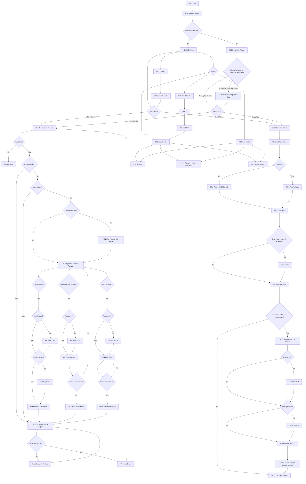

---

# 2. GLOBAL RULES — NEVER REINTERPRET

1. **No mandatory first-3-free-episodes rule.**
2. Every micro-drama episode is independently controlled from backend/CMS.
3. A micro-drama episode may expose any valid combination of:
   - Free
   - Coin unlock
   - Rewarded-ad unlock
   - 0nya Plus
4. Coin price is backend/CMS controlled.
5. Coin-unlocked episodes are permanent entitlements.
6. Micro-dramas have **no pre-roll, mid-roll, or post-roll ads**.
7. Rewarded ads in micro-drama are explicit user-selected unlock actions only.
8. Short films are always playable.
9. Short-film ads are CMS-controlled **mid-roll/post-roll only** for non-Plus users.
10. Plus users watch short films ad-free.
11. Short films are never coin-locked or subscriber-only.
12. Chai is an **0nya coin tip**.
13. There is no separate cash/UPI Chai checkout.
14. Bottom navigation is **Home / Explore / Profile**.
15. Search lives inside Explore.
16. Series card tap goes directly to play/resume.
17. Short-film card tap goes to Short Film Detail first.
18. OTP happens only on an intentional account/monetisation action.
19. OTP success creates/recovers the account independently of later payment/ad success.
20. Return the user to the exact initiating content/context after OTP, unlock, purchase, subscription, or recoverable failure.

---

# 3. FLOW 01 — APP OPEN / HOME / DISCOVERY

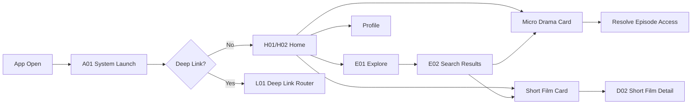

### Home behavior

**H01 — New / Low History**

- Start Here
- Featured / New
- Trending
- New Releases
- Micro Dramas
- Vertical Short Films
- Staff Picks

**H02 — Has History**

- Continue Watching — first row
- remaining editorial rows below it

### Bottom navigation

```text
Home | Explore | Profile
```

No permanent Browse tab.  
No permanent Search tab.

---

# 4. FLOW 02 — MICRO-DRAMA ACCESS ENGINE

Every entry into an episode must pass through the same access resolver.

Entry sources:

- Home
- Continue Watching
- Explore/Search
- Series Detail
- D01 Episodes Tray (same-screen)
- Auto-next
- Deep link

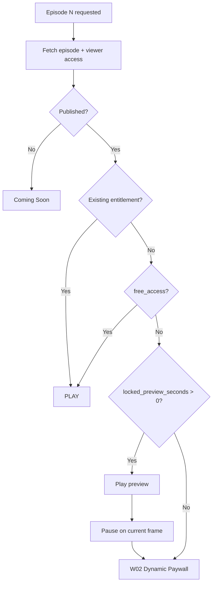

### Backend is authority

The client must not assume:

```text
Episode 1 = Free
Episode 2 = Free
Episode 3 = Free
Episode 4 = Locked
```

That logic is prohibited.

The client must resolve access from backend/CMS.

---

# 5. FLOW 03 — DYNAMIC EPISODE PAYWALL

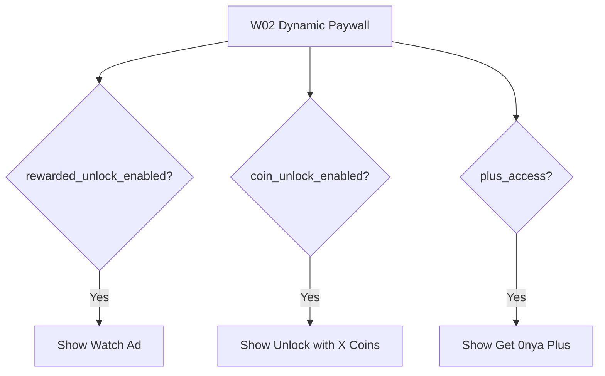

The UI renders **only valid methods**.

Allowed examples:

```text
Coin + Ad + Plus
Coin + Plus
Ad + Plus
Plus only
Coin only
Ad only
```

Never hardcode three buttons.

---

# 6. FLOW 04 — COIN EPISODE UNLOCK

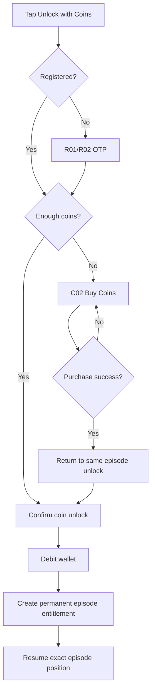

### Important return rule

```text
Episode Paywall
 -> Buy Coins
 -> Purchase Success
 -> Same Episode
 -> Coin Unlock
 -> Player Resume
```

Never:

```text
Buy Coins -> Home
```

---

# 7. FLOW 05 — REWARDED AD EPISODE UNLOCK

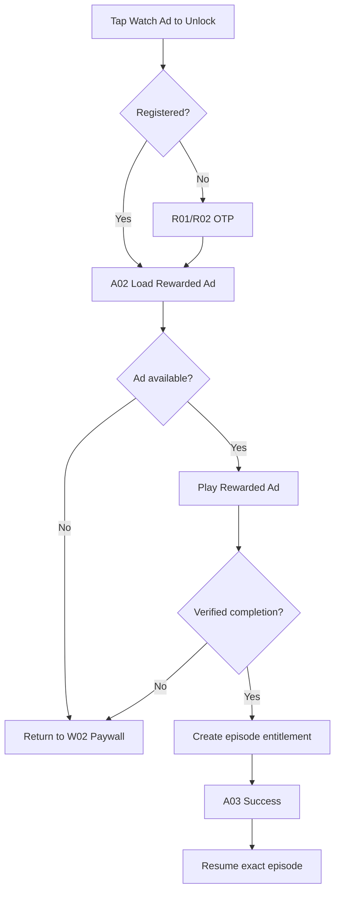

No-fill:

- no penalty
- no unlock
- no forced retry
- keep Coin/Plus methods available

---

# 8. FLOW 06 — 0NYA PLUS

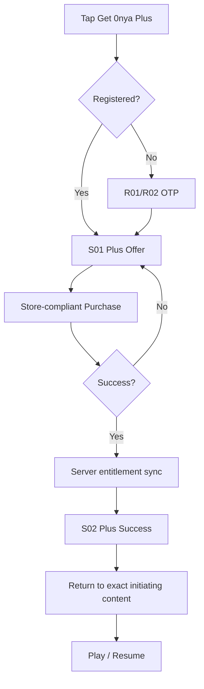

Plus:

- one paid tier
- unlocks applicable released micro-drama episodes
- removes short-film mid/post-roll ads
- raises the server-authorized playback ceiling from Free/Guest 720p to 1440p / 2K where the asset rendition exists
- does not remove coins
- does not remove permanent coin/ad unlocks

---

# 9. FLOW 07 — MICRO-DRAMA PLAYER / SEAMLESS AUTO-NEXT

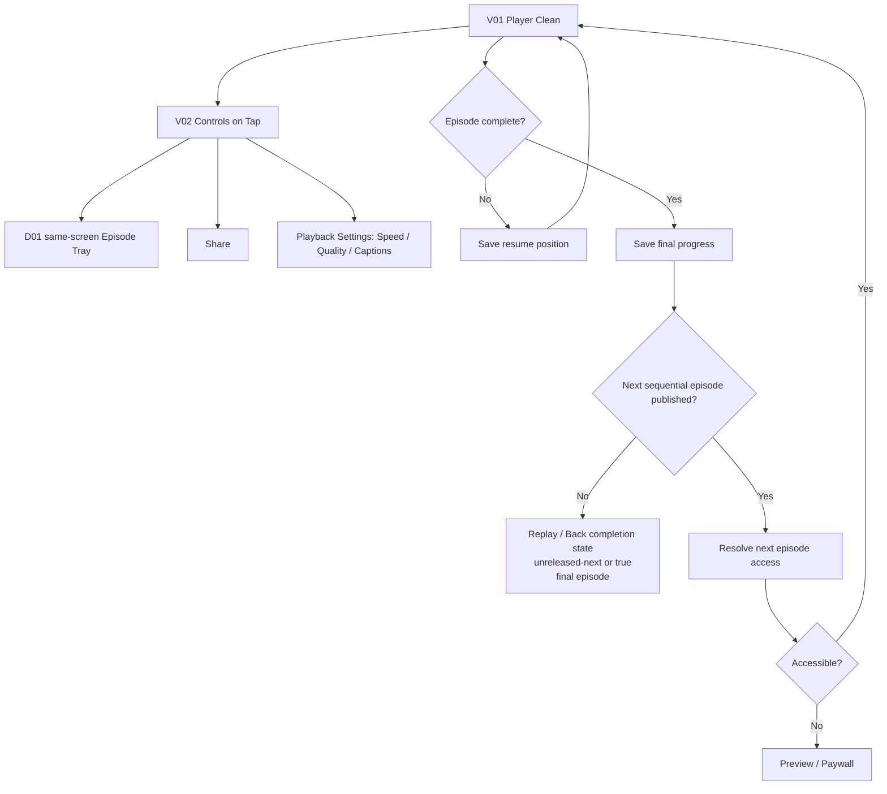

Seamless: no countdown, no "Playing in...", no Play Now/Cancel step. The
transition to the next sequential episode (never a later published episode)
happens immediately based on its existing access state.

No rating screen between episodes.
No recommendation interruption between episodes.

---

# 10. FLOW 08 — CONTINUE WATCHING

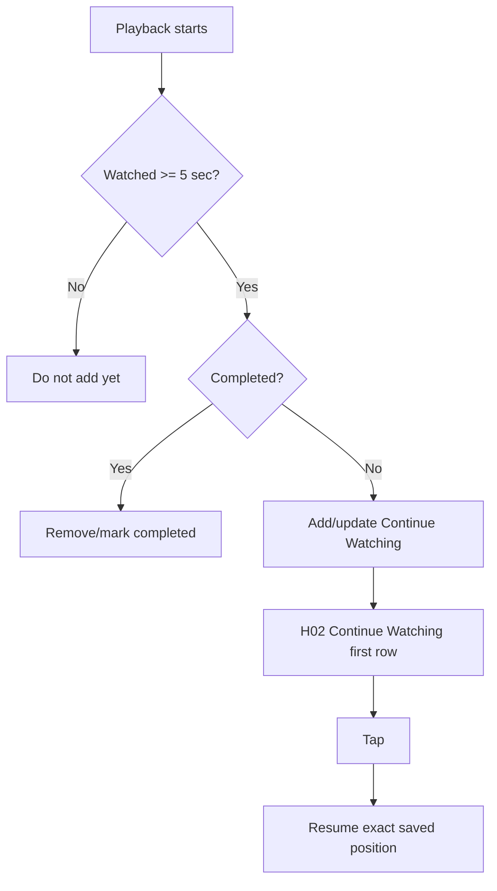

Default completion:

```text
>=95% watched
OR
within final 5 seconds
```

---

# 11. FLOW 09 — SHORT FILM

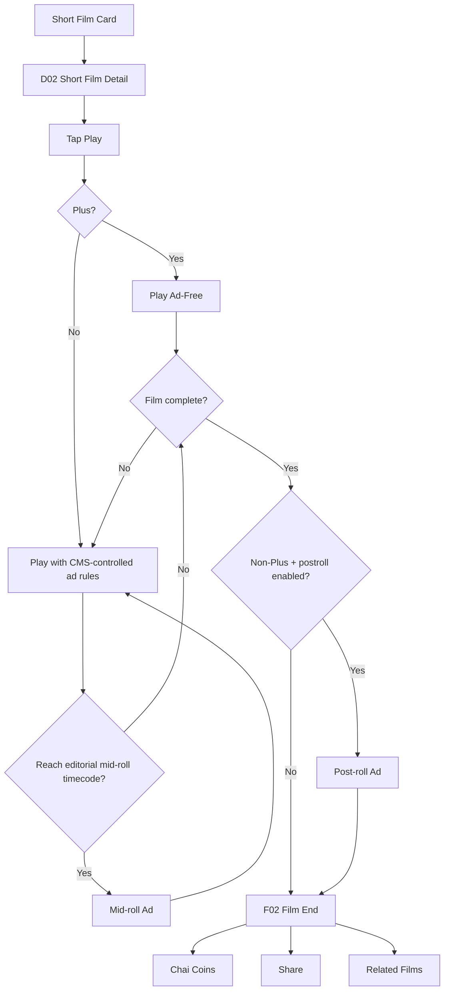

### Short-film rules

- Always playable.
- Never coin-locked.
- Never subscriber-only.
- Non-Plus may receive CMS mid/post-roll ads.
- Plus is ad-free.
- No blind 50% mid-roll if editorial timecodes are available.
- The Chai affordance can reveal in the final ~45 seconds of playback, but it must stay in-context and not auto-open a full-screen T01/T02 flow.
- If ignored, the user can still reach the same compact sheet from the film-end state without changing completion or wallet authority.
- D02 CTA is dynamic: Play for no-valid-progress, completed, or final-zone; Resume for valid unfinished >=5 seconds outside final-zone.
- D02 CTA action must match label: Play starts from beginning for completed/fresh entry; Resume continues latest valid unfinished position.
- F02 hierarchy: Film complete -> film title -> short helper -> Send Chai -> Share/Replay -> Related Short Films (only when real items exist) -> Home.
- System Back from F02 follows navigation stack origin; explicit Home intentionally resets to Home.
- Related Short Films on F02 is catalog/editorial fallback, not semantic recommendation ranking.

---

# 12. FLOW 10 — CHAI COIN TIP

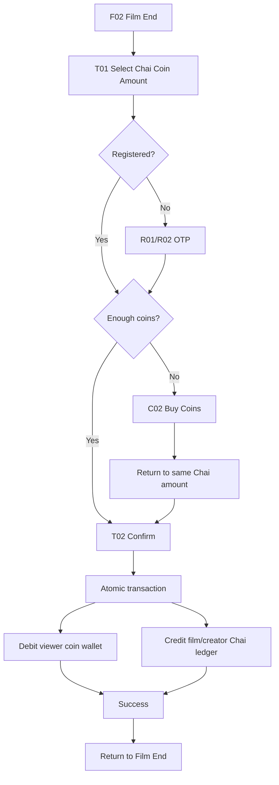

No separate Chai cash checkout.

---

# 13. FLOW 11 — PROFILE / WALLET / ACCOUNT

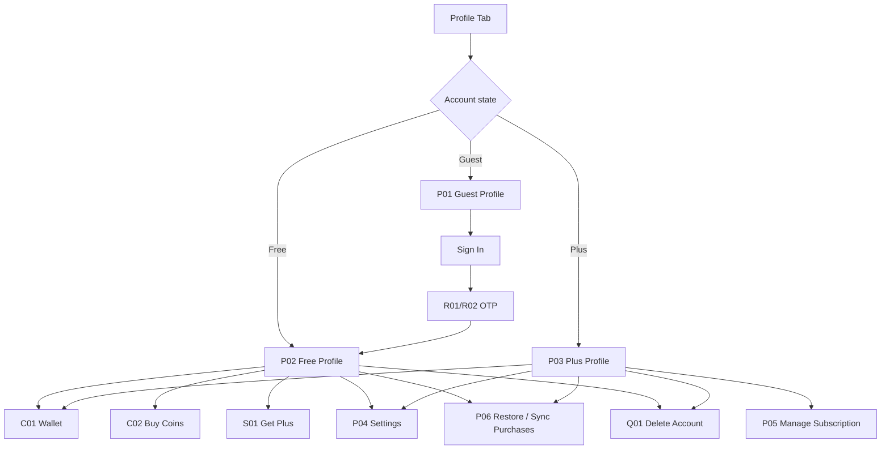

Logout:

```text
Registered / Plus
 -> Logout
 -> Guest Home
```

Never:

```text
Logout -> forced registration
```

---

# 14. FLOW 12 — DEEP LINKS / COMPLIANCE

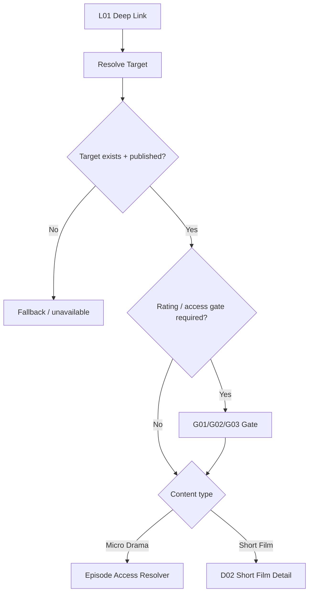

A deep link cannot bypass:

- content rating
- parental control when restrictions are ON and the configured threshold applies
- age verification when applicable
- release state
- entitlement/access rules

---

# 15. FLOW 13 — ERRORS / RECOVERY

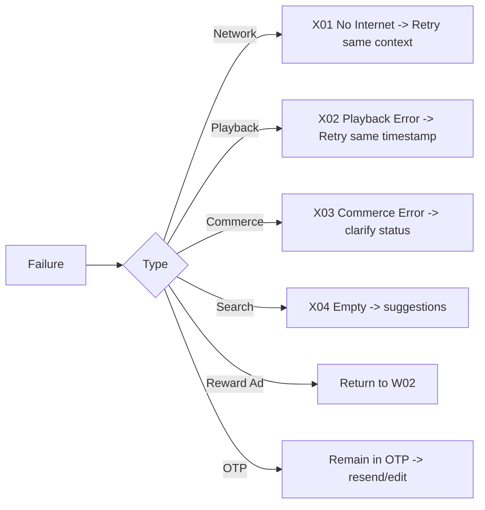

Never dump the user at Home after a recoverable error unless Home is explicitly chosen.

---

# 16. SCREEN ID QUICK MAP

| ID | Screen |
|---|---|
| A01 | System Launch |
| H01 | Home — New/Low History |
| H02 | Home — With History |
| E01 | Explore |
| E02 | Search Results |
| D01 | Series Detail |
| D02 | Short Film Detail |
| V01 | Player Clean |
| V02 | Player Controls |
| V03 | Episode Tray / D01 overlay |
| V04 | Auto-next |
| W01 | Locked Preview |
| W02 | Dynamic Episode Paywall |
| R01 | Phone Entry |
| R02 | OTP |
| C01 | Wallet |
| C02 | Buy Coins |
| A02 | Rewarded Ad |
| A03 | Rewarded Ad Success |
| S01 | Plus Offer |
| S02 | Plus Success |
| F01 | Short Film Player |
| F02 | Short Film End |
| T01 | Chai Coin Amount |
| T02 | Chai Confirm / Success |
| P01 | Guest Profile |
| P02 | Free Profile |
| P03 | Plus Profile |
| P04 | Settings |
| P05 | Manage Subscription |
| P06 | Restore / Sync Purchases |
| G01 | Rating / Descriptors |
| G02 | Parental Gate |
| G03 | Age Verification |
| X01 | No Internet |
| X02 | Playback Error |
| X03 | Commerce Error |
| X04 | Search Empty |
| L01 | Deep Link Router |
| Q01 | Delete Account |

G02 is verification only when parental restrictions are ON, the effective rating
meets or exceeds the configured U/A 13+ or U/A 16+ threshold, and no valid
parental unlock session exists. A stored PIN alone does not enable restrictions.
After successful PIN verification, resume the exact requested content/access
flow; episode entitlement/paywall logic still runs separately.
Parental setup remains a separate Settings action and must not be forced from
the content-access flow when no PIN exists.

---

# 17. FIGMA / BUILD ORDER

Implement in this order:

```text
01 Navigation Shell
   A01 -> H01/H02 -> E01/E02 -> P01/P02/P03

02 Micro Drama Core
   V01 -> V02 -> V03 -> V04 -> W01 -> W02

03 Monetisation
   R01 -> R02 -> C01 -> C02 -> A02 -> A03 -> S01 -> S02

04 Short Films
   D02 -> F01 -> F02 -> T01 -> T02

05 Account / Compliance
   P04 -> P05 -> P06 -> G01 -> G02 -> G03 -> Q01

06 Recovery / Deep Link
   X01 -> X02 -> X03 -> X04 -> L01
```

---

# 18. COPILOT / CLAUDE / CODEX RULE

Before implementing UI or user flow, AI must read:

```text
docs/0nya_PRODUCT_UIUX_BIBLE_v3.0.md
docs/0nya_MASTER_USER_FLOW_v1.1_ALL_IN_ONE.md
```

Then it must inspect existing code before modifying anything.

AI must not:

- recreate the architecture unnecessarily
- introduce a fixed 3-free-episode rule
- create an Episode-4-specific paywall
- hardcode coin price
- hardcode which unlock methods are visible
- put mid/post-roll ads in micro-drama
- create cash/UPI Chai checkout
- coin-lock short films
- create Prime
- add permanent Browse/Search tabs
- add paid services or packages without approval
- send users to Home after an action that should return to playback
- perform broad refactors merely because generated code prefers another pattern

---

# 19. CONFLICT ORDER

If instructions conflict:

1. Current explicitly approved product decision
2. `docs/0nya_PRODUCT_UIUX_BIBLE_v3.0.md`
3. `docs/0nya_MASTER_USER_FLOW_v1.1_ALL_IN_ONE.md`
4. `.github/copilot-instructions.md` / `AGENTS.md` / `CLAUDE.md`
5. Existing implementation conventions
6. AI preference

---

**0nya / शून्य**

**MASTER USER FLOW v1.1 — ALL IN ONE**
